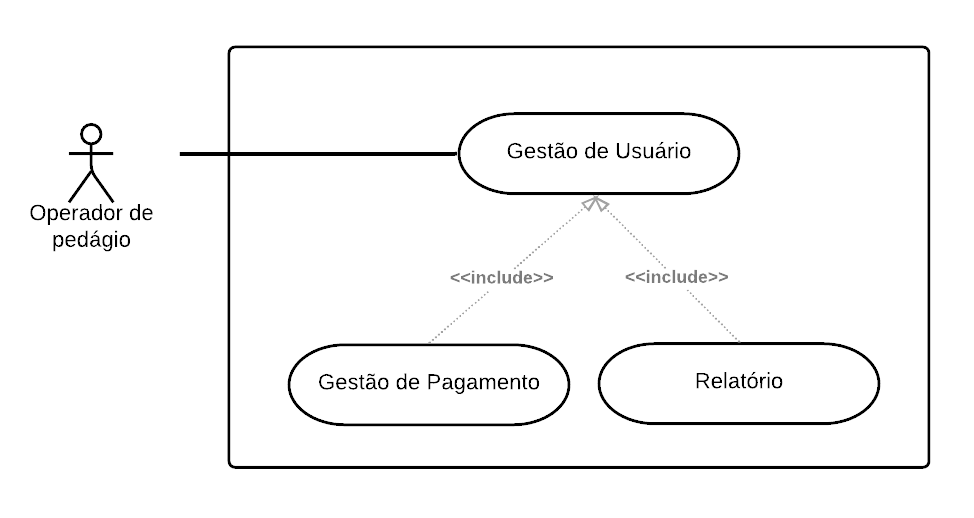

## Universidade Federal de Ouro Preto

  

### Engenharia de Software II

*Sistema de Pedágio 
Grupo: Caffeine++*

|           |                             |
|-----------|-----------------------------|
| Alunos    | Lucas Moreira               |
|           | Lucas Urzedo                |
|           | Matheus Henrique            |
|           | Sabrina Suellen             |
|           | Victor Martins              |
| Professor | Msc prof. Johnatan Oliveira |
| Horário   | Ter & Qui - 15:20 - 17:20   |

*Ouro Preto, 18 de Junho de 2021*

## Conteúdo

- [1 Histórico de Revisões](#revisions-history)
- [2 Processo e Software](#process-and-software)
- [3 Cronograma](#schedule)
- [4 Levantamento de Requisitos](#requirements-gathering)
- [5 Especificações de Requisitos](#requirement-specifications)
    - [5.1 Requisitos Funcionais](#functional-requirements)
    - [5.2 Requisitos Não Funcionais](#non-functional-requirements)
- [6 Plano de VVT](#vvt-plan)
    - [6.1 Requisitos a serem testados](#requirements-to-be-tested)
    - [6.2 Estratégias e ferramentas de teste](#testing-strategies-and-tools)
    - [6.3 Equipe e infra-estrutura](#team-and-infrastructure)
    - [6.4 Execução do Plano de Teste](#test-plan-execution)
- [7 Medição e Qualidade de Software](#software-measurement-and-quality)
- [8 Observações](#comments)
- [9 Referências](#References)

# Processo e Software

Após analisado o problema dado foi discutido que o processo de software que melhor atende o que deve ser feito e a forma
como será feito é a metodologia ágil Scrum. Por meio deste modelo é possível manter o alinhamento da equipe de produção
com o cliente ou usuário final, visto que a cada incremento de valor existe a validação do cliente para que o projeto
siga de forma rápida e consistente com o que é esperado.

# Cronograma

| Código            | Serviço                                                        | Descrição |
| :--------------   | :------------------------------------------------------------- | :-------- |
| Sabrina Suellen   | Justificativa do processo de software                          | 21/06     |
| Victor Martins    | Diagramas de Casos de Uso e Descrição dos cenários             | 28/06     |
| Sabrina, Victor   | Levantamento dos Requisitosdo software                         | 19/07     |
| Lucas U., Matheus | Implementação do sistema                                       | 20/07     |
| Sabrina, Victor   | Plano de verificação, validação e teste de software            | 26/07     |

# Levantamento de Requisitos

## Diagrama de Caso de Uso

## Descrição de Caso de Uso

| Nome | Tarefa            | Prazo                                             |
| :--- | :---------------- | :------------------------------------------------ |
| RF01 | Gestão de Usuário | Permite e gerencia o acesso do usuário ao sistema |
| RF02 | Gerir pagamento   | Realiza o pagamento do pedágio                    |
| RF03 | Gerar relatório   | Resume e exibe os pagamentos ja realizados        |

Tabela 3: Descrição dos Casos de Uso

# Especificação de Requisitos

## Requisitos Funcionais

**RF01– Gestão de Usuário** Serviço relacionado às tarefas de autenticação do operador de pedágio.

- **Cadastro:** O registro do operador no sistema é realizado a partir da entrada dos dados via campo de texto. São os
  dados de nome, data de nascimento, cidade/estado, registro pessoal, e-mail e senha.

- **Recuperação de senha:** A recuperação de senha ocorre a partir da entrada dos dados via campo de texto. São os dados
  de nome e registro pessoal previamente cadastrados e da nova senha.

- **Login:** O login é realizado a partir da entrada do nome e da senha previamente cadastrados, ambos previamente
  cadastrados.

**Regras**:

- O sistema deve verificar se data de nascimento, registro pessoal e email são valores válidos.

- Quando for realizado o Login ou a Recuperação de Senha, o sistema deve validar se os dados informados correspondem aos
  dados que populam o banco de dados.

**RF02– Gerir Pagamento** Serviço relacionado a efetuação do pagamento do pedágio. São informados os seguintes dados via
campo de texto: tipo de veículo, placa do veículo, método de pagamento, valor e anotação
(opcional). O sistema retorna o troco baseado no valor pago. **Regras**:

- O sistema deve validar o valor pago. Ele deve ser maior que zero e maior ou igual ao valor estipulado para pagamento.

**RF03– Gerar Relatório** Serviço relacionado a geração de um relatório com a quantidade total de pagamentos realizados
em relação à categoria do veículo.

## Requisitos Não Funcionais

### Usabilidade

**RNF01** A aplicação a ser desenvolvida deverá ser de fácil aprendizagem, bem estruturado e sinalizando.

### Desempenho

**RNF02 Capacidade** A aplicação não possui limite de usuários, essa quantidade de funcionários deve ser administrado
pelo gerente do Pedágio

### Portabilidade

**RNF03 Tecnologias Utilizadas para o desenvolvimento** A tecnologia adotada para desenvolvimento será JavaScript.

**RNF04 Compatibilidade com Navegador** A aplicação será compatível com todos os navegadores.

### Requisitos Legais

**RNF05** Privacidade quanto aos dados dos funcionários cadastrados.

### Requisitos de Segurança

**RNF06** Realização de login com código e senhas cadastrado no sistema.

### Manutenibilidade

**RNF07** Os componentes a serem desenvolvidos para o sistema devem possuir extensibilidade, ou seja, devem facilitar a
adição de novas características que se fizerem necessárias.

# Plano de VVT

## Requisitos a serem testados

**Gestão de Usuários:** o objetivo deste teste é a verificação do usuário registrado e ao login deste, é feito também a 
validação de campos de senha e semelhantes.
- verificar se registro foi criado.
- verificar login com registro criado.

**Gestão de Pagamento:** validação dos campos como de pagamento, veículo e placa do veículo.
- verificar veículos e suas placas.
- verificar valores inseridos.
- realizar tabela de relatório.

Ao realizar teste de interface do usuário em ambos os serviços que compõem o sistema, o foco deve estar em verificar se os botões estão funcionando corretamente, se a interface está de acordo com os requisitos que foram estabelecidos e verificar se o aplicativo satisfaz à regra de negócio.

Testes de segurança são usados com o intuito de revelar falhas e garantir a qualidade do software, verificando a proteção dos dados relacionados ao software e conferindo aspectos relacionados à proteção dos dados pessoais e redirecionamento para sites maliciosos.

## Estratégias e ferramentas de teste

A ferramenta utilizada para testes sistemáticos foi o Jest, um framework open-source para execução de testes unitários baseado em JavaScript. O framework foi criado para testar o framework React, mas sua implementação se tornou muito mais ampla e se expandiu para outras plataformas como Node, Redux, e até mesmo plataformas em TypeScript como Angular e Ionic.

Os testes unitários são testes executados com a intenção de testar cada unidade do sistema individualmente, modelando os testes a partir de uma perspectiva interna do sistema. Assim, os testes unitários são aqueles testes onde o objetivo é isolar cada parte do sistema para garantir que elas estejam funcionando conforme especificado.

## Execução do Plano de Teste
### Registro Usuário

**Features** Testar a funcionalidade de registrar usuário.

**Cenário** O administrador deseja realizar o cadastrado de um usuário.

### Fazer Login

**Feature** Testar a funcionalidade de login.

**Cenário** O usu ́ario que foram registrados, realizam login no sistema

### Registrar pedágio

**Feature** Testar a adicão de pedágios.

**Cenário** O usuário realiza a adição dos veículos.

### Exibir Relatório

**Feature** Testar relatório dos veículos registrados.

**Cenário** Ao fim do expediente os usuários precisam fazer um relatório
onde será retornado o total de veículos que passaram.

# Medição e Qualidade de Software

Apresente aqui o formato da Medição e qualidade de software. Você deve mostrar os meios que irá avaliar a qualidade do
seu software. Apresente o plano e os resultados a partir da prática de ferramentas de detecção de code smells, por
exemplo. Em Java, temos uma ferramenta chamada JDEODORANT. Você pode avaliar as métricas de qualidade também, por
exemplo, em Java, temos CKMetrics\[1\]

## Observações

Apresente aqui as dificuldades na disciplina, trabalho pr´atico e coisas do
tipo

 
Figura 1: Exemplo

## Referências

- [1] Sommerville, Ian -- Software Engineering, 8th Edition;
- [2] Johnatan Oliveira -- Transparências de aula no Moodle;

